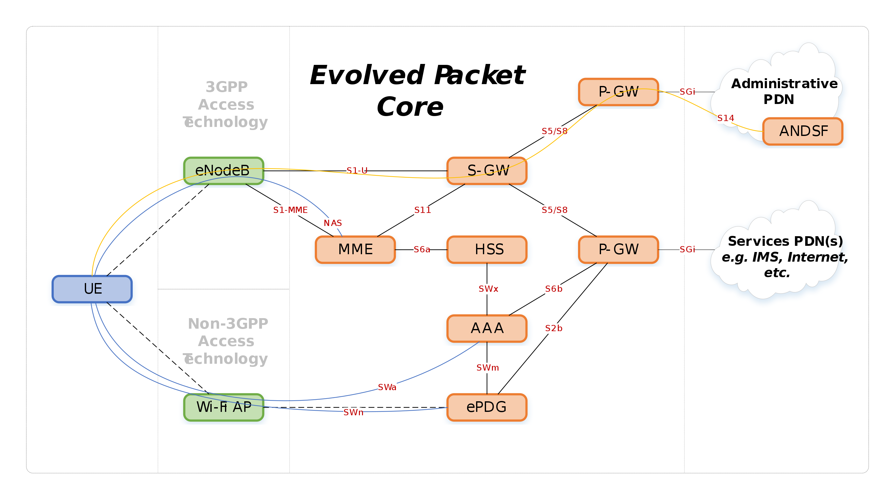
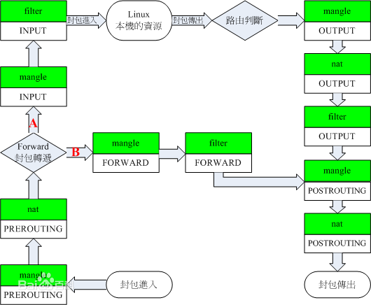
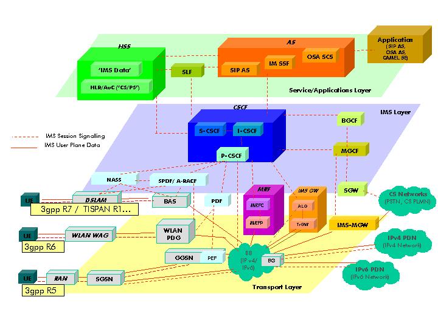
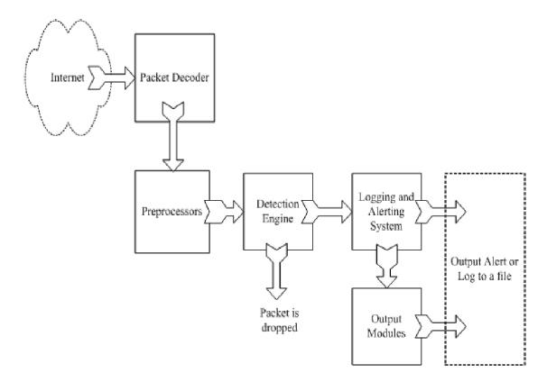
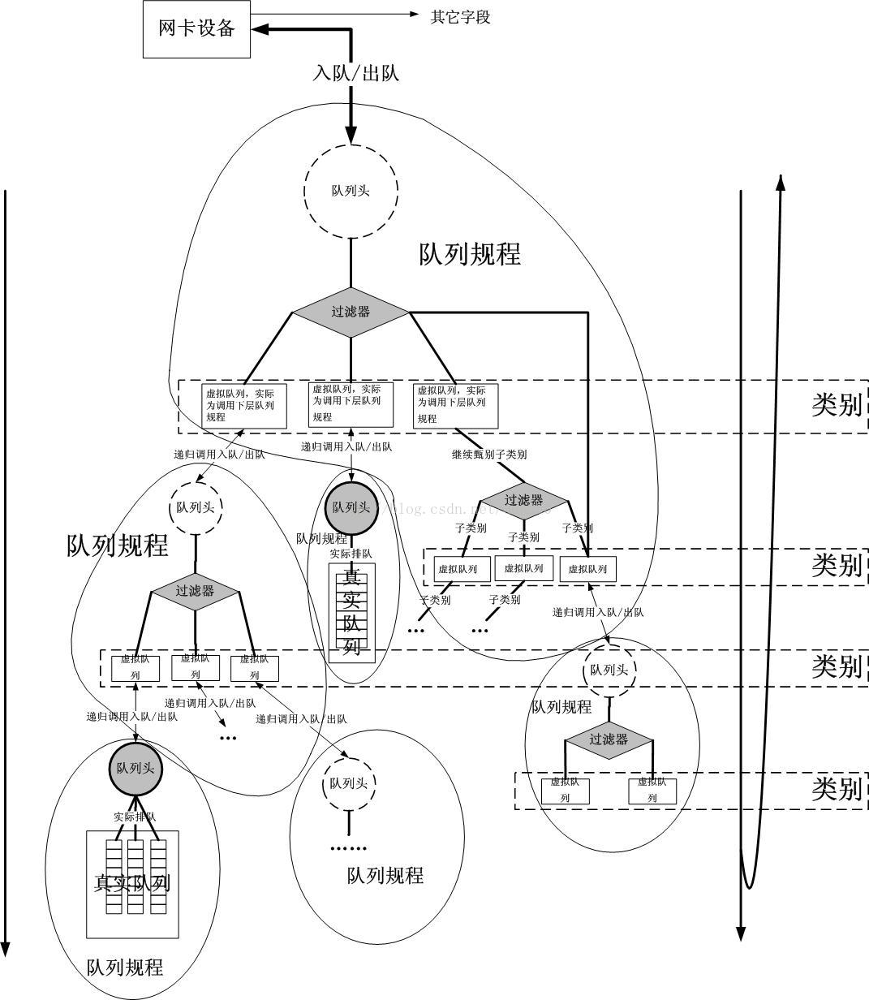
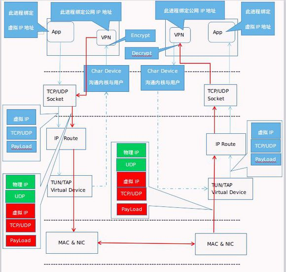
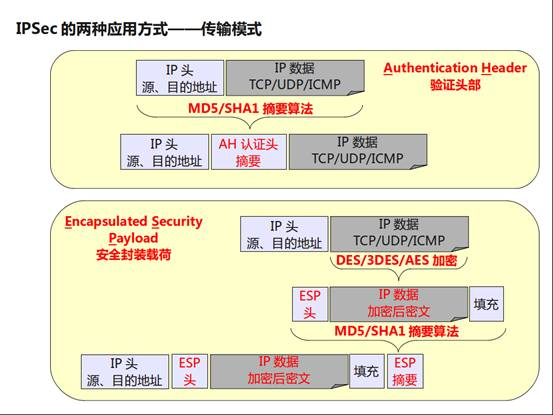

# common_nf_research

对一些常见或者popular的nf进行调研

Caching
- 参考资料
    - http://nginx.org/en/
- 维护状态
    - 全局事件池
    - 请求-指令映射
    - 缓存
- workflow
    - 请求的处理时基于HTTP请求。请求放在轮询池中，每次选取一个请求，基于配置文件中的位置选择一个合适的处理模块，负载均衡模块选择后端服务器进行处理，并把输入缓冲放在过滤模块上，最后将响应返回给客户端

compression(cisco ios)
- 参考资料
    - https://www.cisco.com/c/en/us/support/docs/wan/data-compression/14156-compress-overview.html
- 维护状态
    - 流表
    - 字符串映射规则
- workflow
    - cisco的ios系统中涉及到了压缩。可以压缩整个包、压缩头部、压缩负载部分。压缩的过程是以连接为核心的。
    - 对每个单独的连接进行分别的压缩流程，根据规则选择相应的压缩方法。
        - 如果是以包单位进行压缩，读取相应的数据（头部、负载等），压缩后进行覆盖，如果压缩的部分包括头部，需要从新建立头部封装。
        - 如果是以连接单位进行压缩，还需要缓存上一个包的相关数据，映射规则由上个包的内容和这一个包的内容共同决定，其他和上面相同。

EPC
- 参考资料
    - https://gitlab.eurecom.fr/oai/openair-cn/tree/master/
- 维护状态
    - 用户状态
    - SLA/Usage per device/plan（这是根据S6论文上总结的加上的，但是我并没有看到相应的东西）
- workflow
    - 
    - EPC由以下四个部分组成：移动管理实体，用来根据数据管理会话的状态、认证并追踪用户；服务网关；分组数据节点网关，作为LTE网络和其他分组数据网络间的端口，管理服务质量并提供深度数据包检测；政策及收费功能
    - 整个流的流向是比较复杂的一张图，大概经过上述的四个部件，并对相应的数据包进行封装，统计相应的数据

Firewall
- Basic Firewall
    - 资料来源
        - S6框架
        - https://github.com/antonioribeiro/firewall
        - https://github.com/puppetlabs/puppetlabs-firewall
    - 维护状态
        - 哈希流表
        - 黑白名单
        - 连接的状态（源、目的地址和端口，请求个数，连接时间）
    - workflow
        - 通过流表判断新旧连接
        - 如果有新的连接，读取源、目的地址和端口，根据这些对黑白名单进行查询，决定是否通过。有些防火墙会读取负载，并统计连接有关的信息(比如一段时间内的请求次数，可疑字符串等)，进行动态拦截。
- iptables
    - 参考资料
        - ubuntu iptables 1.2.7
    - 维护状态
        - iptables结构变量
            - filter表：负责过滤
            - nat表：网络地址转换
            - mangle表：拆解报文，作出修改，重新封装 
            - raw表：关闭nat表上启用的连接追踪机制
        - 用链表构成的规则容器
        - 流表
    - workflow
        - 
        - 在进行规则匹配的时候，用户的数据报是层层过滤的，逐条匹配表 中的规则，默认规则位于最后一条，如果前面匹配成功则执行相应规则，忽略后面的规则。
        - iptables中的NAT属于prerouting过程，一般优先于filter执行。

Gateway(Conf/Voice/Media)
- 参考资料
    - https://www.cisco.com/c/en/us/products/switches/mgx-8800-series-switches/index.html
- 维护状态
    - MAC地址表
    - 路由表
- workflow
    - cisco MGX执行交换机的功能
    - 在执行过滤和转发过程中的时候，会读取数据包的源ip和目的ip，通过全局的MAC地址表或者路由表进行转发和过滤。

IMS
- 参考资料
    - https://www.openimscore.com/
    - https://zh.wikipedia.org/wiki/IP%E5%A4%9A%E5%AA%92%E4%BD%93%E5%AD%90%E7%B3%BB%E7%BB%9F
- 维护状态
    - SIP/RTP会话
    - 用户的使用状态和消费账单
- workflow
    - 
    - IMS主要提供一套会话控制系统，来方便用户通过IMS进行多媒体传输，主要是以会话为单位进行操作

IDS/IPS(snort)
- 参考资料
    - https://www.snort.org/snort3
- 维护状态
    - 黑名单
    - 流表
    - 连接信息(如检测到可疑信息次数等)
- workflow
    - 
    - 根据流表判断新旧连接，新连接创建分别的监听对象
    - 持续监听所有连接，一个新的数据包到达进行以下步骤
        - 在packet decoder中进行报文粗分析，主要解析ip头
        - 在preprocessor进一步解析报文，重组被分片的报文，解析http/ftp/ssh等协议内容
        - detection engine中对报文进行内容上的检测，包括匹配可疑字段、统计流方向等。
        - 后面统计得到的信息，并输出log

Load balancer
- 参考资料
    - https://github.com/github/glb-director/tree/master/docs
- 维护状态
    - 哈希流表
    - 重定向映射
    - 连接状态
    - 重定向目的服务器状态池
- workflow
    - 根据流表判断新旧连接
    - 一条新的连接需要首先通过哈希ipv4五元组获得一个默认的重定向，然后根据动态负载算法进行微调。
    - 旧连接会根据负载均衡控制器，每隔一段时间进行一次health check，如果有违背规则的连接则会被重定向。

NAT
- 资料来源
    - S6框架
    - https://tools.ietf.org/html/rfc2663
- 维护状态
    - 哈希流表
    - 公网地址池（内网-外网地址及端口映射）
- workflow
    - 通过流表判断新旧连接
    - 一个连接到来，读取ip5元组判断新旧连接，对于新的连接，创建映射并放到地址池中，旧连接取出相关的映射。然后需要重新计算涉及到ip地址的字段（如校验和），最后重新组成新的数据包发送。

Monitor(prads)
- 参考资料
    - http://manpages.ubuntu.com/manpages/xenial/en/man1/prads.1.html
    - NetFlow
- 维护状态
    - asset(流状态)
    - 全局统计数据
    - 哈希流表
- workflow
    - 根据流表判断新旧连接
    - 新连接创建新的asset对象
    - 读取数据包的相关信息（ip5元组、包大小等），根据实际信息更新统计数据（主要统计流量）

Proxy(squid)
- 参考资料
    - https://github.com/squid-cache/squid
- 维护状态
    - 流表
    - 以某种形式组织的网页相关cache
- workflow
    - 以上面的squid为例，包括一个主要的服务程序squid，dns查询程序dnsserver，几个重写请求和执行认证的程序
    - 根据流表判断新旧连接，新连接创建新的相关instance
    - 每次squid主程序解析url连接中，获得请求资源的信息，接下来会通过hash中寻找资源，如果没有，可以向sibling node请求资料，如果sibling没有，直接向parent node要数据，parent也没有就会访问internet。然后将请求到的数据缓存下来。
    - 连接请求过的资源会被以Interent Cache Protocol缓存

Traffic Shaper
- 参考资料
    - linux traffic control
    - https://en.wikipedia.org/wiki/Tc_(Linux)
- 维护状态
    - 过滤器及队列
- workflow
    - 
    - 对每一个新的包，通过树状的过滤器进行流量调整。
    - 一个数据包从网卡中进入一个过滤器，开始过滤；过滤器提取头信息，根据过滤器的规则可能提取不同的头的信息，然后转发到不同的队列中；更下方的过滤器从这些队列中再分别提取包，递归转发。

VPN(openvpn)
- 参考资料
    - https://openvpn.net/
- 维护状态
    - 虚拟网卡及配置信息
    - 加解密配置
    - IP地址、路由设置
- workflow
    - 
    - 一个新的数据包到达发送方后，通过虚拟的网卡或者隧道，在包的外层封装一层虚拟的ip头、tcp/udp头，到达路由器，路由器通过tcp/udp套接字，并发往用户态的vpn加密模块，经过加密之后可以发送到接收方。
    - 接收方通过解密，将解密后的数据发送给tcp/udp套接字，脱去封装的虚拟ip、tcp/udp头，用虚拟的网卡或者隧道进行最后的转发。

ipsec
- 参考资料
    - https://zh.wikipedia.org/wiki/IPsec
    - https://zh.wikipedia.org/wiki/StrongSwan
- 维护状态
    - 当前SA(security association)
- workflow
    - 
    - 
    - 当前的SA是通过IKE方法在两台主机之间协商而成，具有时效性。
    - ipsec提供三个特性：每一个IP包的认证；验证数据完整性；数据包的加解密。其中认证和验证完整性都可以通过AH协议完成，这三个也都可以通过ESP协议完成。
    - AH协议主要是对原数据包的整个包(包括头部)计算一个AH认证头摘要 ，放在最外一层的IP头后面
    - ESP协议对原数据包除去最外一层IP头，剩下的部分进行加密。并添加ESP头和填充，append到最外一层IP头的后面。

